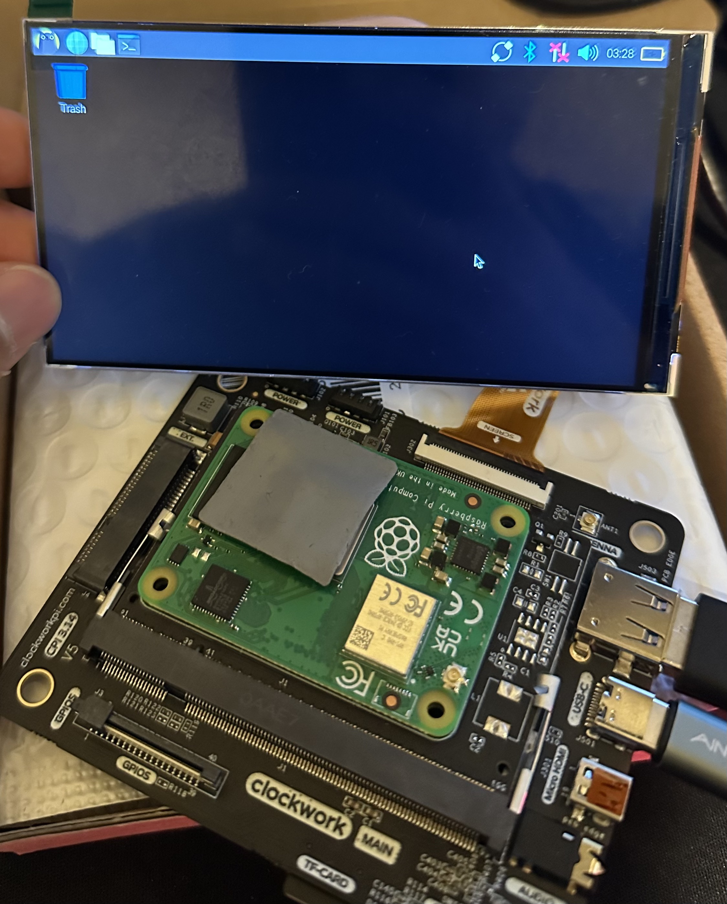

# Mirai OS image build instruction
#### FYI Pi-Gen had been modified to support a custom kernel for Raspberry Pi CM4+Clockwork Pi motherboard or U-console.
#### Original Fork of Pi-Gen from Raspberry Pi: [Official Link](https://github.com/RPi-Distro/pi-gen), [Official Document about Kernel from Raspberry Pi](https://www.raspberrypi.com/documentation/computers/linux_kernel.html) 
#### Original Fork from U-console CM4 OS-image: [Support Link](https://github.com/cuu/pi-gen/tree/uconsole_arm64)
#### Information about custom Kernel for CM4+Clockwork Pi: [Support Link](https://github.com/cuu/ClockworkPi-linux/commit/9a1e3adc9d1431889f62e633ae791bfc9a6cf535), [Build Custom Kernel](https://github.com/clockworkpi/uConsole/tree/master/Code/patch/cm4/20230630)
#### Old Kernel Official from U-console CM4 board provides driver for all hardware pheripherals on Clockwork Pi v3.14: [Download Link](https://github.com/clockworkpi/apt/blob/main/debian/pool/main/u/uconsole-kernel-cm4-rpi/uconsole-kernel-cm4-rpi_0.13_arm64.deb)
#### Official Guideline on building OS image from Clockwork Pi: [Support Link](https://github.com/clockworkpi/uConsole/wiki/How-uConsole-CM4-OS-image-made)
#
1. Pi-Gen Dependencies, on CLI or Terminal (example of Ubuntu) 
- ```sudo apt install -y coreutils quilt parted qemu-user-static debootstrap zerofree zip dosfstools libarchive-tools libcap2-bin grep rsync xz-utils file git curl bc qemu-utils kpartx gpg pigz ```
2. To build OS image, first navigate inside pi-gen directory by doing ``` cd pi-gen/ ```.
3. Then, run .sh script on terminal under superuser privilege  by doing ``` sudo ./build.sh ```.
4. Output of OS will be on deploy folder
5. To flash OS image on SD card you need software like Raspberry Pi imager [Download Here](https://www.raspberrypi.com/software/), or Balena Etcher [Download Here](https://etcher.balena.io/)
6. When you successfully flash it on SD card or mini SD card for your CM4+ Clockwork Pi 3.14 it will work!

FYI it is important to clean up all existing images before you rebuild a new one by doing  ``` sudo ./clean.sh ``` this command will clean up the deploy folder. Only do it when you want to rebuild the image!


